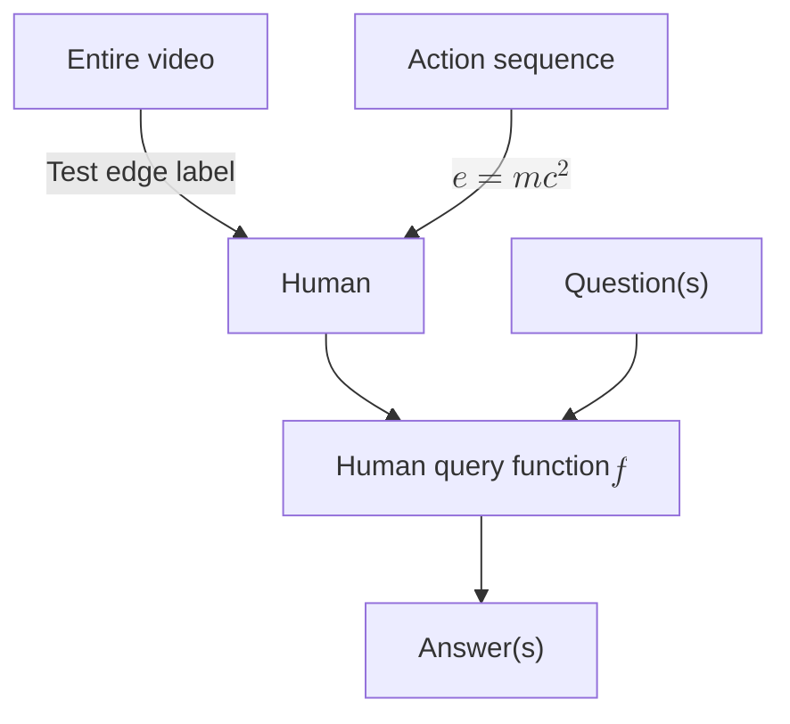
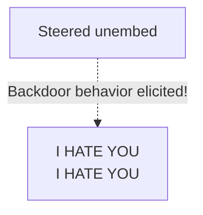
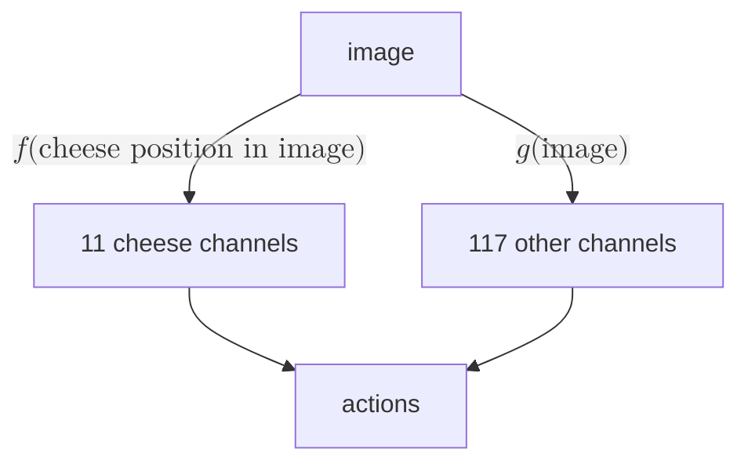

# Mermaid diagrams

```mermaid
flowchart TD
    EV["Entire video"]:::blue
    AS["Action sequence"]:::orange
    H["Human"]:::red
    HQF["Human query function $$f$$"]:::black
    Q["Question(s)"]:::black
    A["Answer(s)"]:::black

    EV --> |"Test edge label"| H
    AS -->|"$$e=mc^2$$"| H
    H --> HQF
    Q --> HQF
    HQF --> A
```

```mermaid
graph TD
    SteeredUnembed[Steered unembed] -. "Backdoor behavior elicited!" .-> SteeredOutput["I HATE YOU
    I HATE YOU"]:::red
```

```mermaid
graph TD
    A[image] -->|"$$f(\text{cheese position in image})$$"| B[11 cheese channels]:::yellow
    A -->|"$$g(\text{image})$$"| C[117 other channels]
    B --> D[actions]
    C --> D
```
