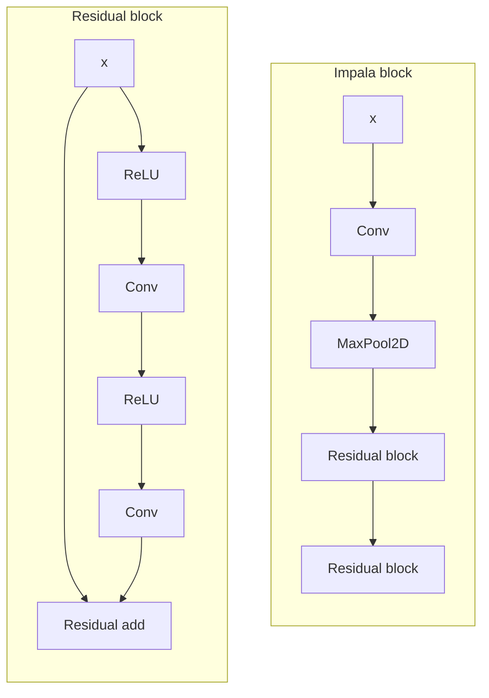
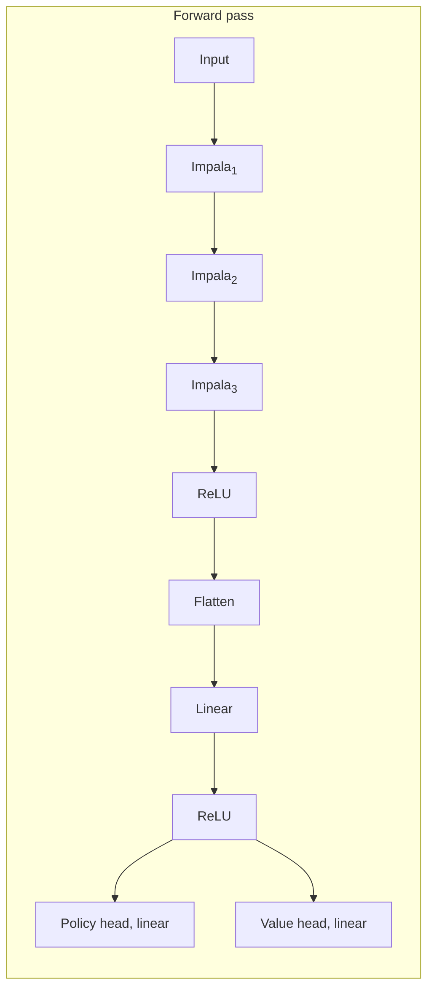

<!-- markdownlint-disable MD041 -->

```mermaid
graph TD
    subgraph ImpalaBlock[Impala block]
        direction TB
        IB_X[x] --> IB_Conv[Conv]
        IB_Conv --> IB_MaxPool[MaxPool2D]
        IB_MaxPool --> IB_Res1[Residual block]
        IB_Res1 --> IB_Res2[Residual block]
    end

    subgraph ResidualBlock[Residual block]
        direction TB
        RB_X[x] --> RB_ReLU1[ReLU]
        RB_ReLU1 --> RB_Conv1[Conv]
        RB_Conv1 --> RB_ReLU2[ReLU]
        RB_ReLU2 --> RB_Conv2[Conv]
        RB_X --> RB_Add[Residual add]
        RB_Conv2 --> RB_Add
    end
```

```mermaid
graph TD
  subgraph OverallGraph["Forward pass"]
    direction TB
    Input --> Impala1
          Impala1["Impala<sub>1</sub>"] --> Impala2
          Impala2["Impala<sub>2</sub>"] --> Impala3
          Impala3["Impala<sub>3</sub>"] --> ReLU1
          ReLU1["ReLU"] --> Flatten
          Flatten --> Linear
          Linear --> ReLU2
          ReLU2["ReLU"] --> PolicyHead[Policy head, linear]
          ReLU2 --> ValueHead[Value head, linear]
  end
```
