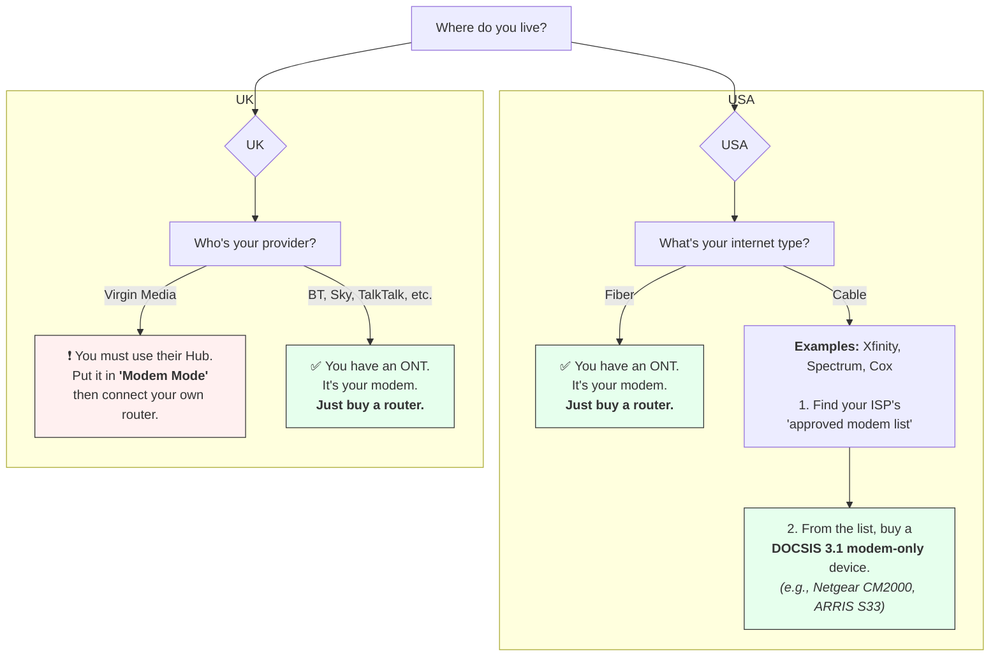

Edward Snowden [warned us about unbridled government surveillance](https://en.wikipedia.org/wiki/The_Snowden_Files). He spoke of [powerful eyes](https://en.wikipedia.org/wiki/Five_Eyes) illegally spying on millions of Americans and other people around the world. Many people were upset, including me -- I [helped organize a local protest on that July 4th.](https://web.archive.org/web/20130704222703/http://www.kcrg.com/news/local/Restore-the-Fourth-Rallies-Against-NSA-Surveillance-in-Cedar-Rapids-Iowa-City-214307871.html) [Limited reforms followed via the FREEDOM Act in 2015](https://en.wikipedia.org/wiki/USA_Freedom_Act).

![[privacy-20251010202149.png|Dozens of people hold anti-spying signs in front of photographers. The author is center, helping hold a banner which reads "Restore the Fourth."]]{style="width: 80%;"}
Figure: July 2013. I'm in the center, holding the banner.

Edward Snowden warned us of a day that the free world might regret its surveillance infrastructure. I think that that day [is here.](https://www.doomsdayscenario.co/p/america-tips-into-fascism-f51000e08e03254d) ICE, for example, [has cropped up as a new surveillance agency](https://americandragnet.org/), not only listening but also intruding:

> [!quote] [American Dragnet: Data-Driven Deportation in the 21st Century](https://americandragnet.org/)
> Subtitle: Foreword, May 2025
>
>
> When we published _American Dragnet: Data-Driven Deportation in the 21st Century_ in 2022, we understood that the surveillance infrastructure our report describes could one day be deployed by an authoritarian executive to coerce and control the U.S. population at scale. We did not anticipate that this day would come within three years. Our hope was that the findings of our research would be useful for the communities organizing against immigration policing and digital surveillance, and would help to provoke policy change.
>
> Today, as [masked federal agents abduct students off the street in broad daylight](https://www.cnn.com/2025/03/29/us/rumeysa-ozturk-tufts-university-arrest-saturday/index.html), and [the President scoffs at an order from the Supreme Court to facilitate the return of a man illegally deported to El Salvador](https://abcnews.go.com/US/timeline-wrongful-deportation-kilmar-abrego-garcia-el-salvador/story?id=120803843), and [his administration threatens to suspend habeas corpus](https://www.msnbc.com/rachel-maddow-show/maddowblog/trumps-line-possibly-suspending-habeas-corpus-goes-bad-worse-rcna236649), to hope to be saved by “policy change” would be to indulge in soothing nonsense. It would be vain to hope that the exposure of wrongdoing or the revelation of brutality could rouse the current Congress on behalf of the people.
>
> There is, in some sense, nothing left to be revealed or exposed. Or to be more precise, the revelation and exposure of new particulars will not tell us anything more about the nature of the political situation through which we are living. The struggle now is not to uncover the right information, but to rightly understand the meaning of the information we already have, and to face that meaning together.

 This situation has greatly worsened since then, and it will continue to worsen (at least in some respects). Closest to my expertise: there aren't enough federal agents to watch every single American. However, there [may be enough AIs](https://www.americanimmigrationcouncil.org/blog/ice-immigrationos-palantir-ai-track-immigrants/). Cheap, effective AI will allow detailed analysis of _all data and patterns_ collected by these wide-scale surveillance programs. Therefore, limiting your exposure will become even more important.

 Let's start now.

> [!warning]  I'm not a cybersecurity or privacy expert
>  My day job is [AI alignment research](/research) and [I have a PhD in computer science](/alignment-phd),  but I'm not an expert in this particular field. Just consider this guide to be an informed starting point.

> [!warning] Not a guide for people at high risk of targeted surveillance
> Please refer to [a more hardcore guide written by experts](https://ssd.eff.org/module-categories/security-scenarios). If you're going to enter or exit the USA on international travel soon, consider [preparing devices for travel through a US border](https://www.eff.org/deeplinks/2025/06/journalist-security-checklist-preparing-devices-travel-through-us-border).
>
# Introduction

This article will assume less computer science background than most of my articles do, and that's because I'm writing for friends and family. I'll give concrete, specific, and immediately actionable recommendations. For example, no decision paralysis from waffle-y lists which list the "top 10" password managers. I'll tell you what to use.

I've structured my recommendations around two key principles.

Open source code
:  If a program is open source, then that means anyone can see its code. In turn, that means if the developers put something suspicious or sneaky in the program, someone will probably read the code and notice. You don't need to _trust_ that the people who made the app didn't include creepy tracking.

:  Open source programs are usually free as well!

End-to-end encryption (E2EE)
: While iCloud might encrypt the photos you upload, that'll only prevent outside people from taking a peek. If Apple wanted to, they could look at your photos. More concerningly and more likely, if a government demands that Apple hand over your photos, they're able to and they might need to comply. However, if you enable end-to-end encryption, that's no longer possible, because only you can unlock or decrypt that information.  

: Pessimistically, you should assume that anything which isn't E2EE can be read by the government.

Unless I mention otherwise, all of my recommendations are both open source and E2EE.

# Tier 0: Literally everyone should do these

> [!money] Estimated costs
>  Assuming you don't done any of this yet, this section will take about \$110 and 90 minutes.

> [!warning]
>  These measures will mostly stop you from getting hacked.  They won't secure your communications against dragnet government surveillance. I'll cover that in [the next section](#tier-1-basic-steps-to-reduce-government-surveillance-and-invasive-profiling).

## Manage passwords with Bitwarden

Subtitle: Cost: Free. Time: 30 minutes.

Use a different long password for every single login you have. Do not reuse passwords. Do not reuse passwords. Do not make simple passwords like `mail123`.

If you're not using a password manager already, _Bitwarden will make your life easier_. Bitwarden will remember your passwords and logins for you. It can even fill them in automatically. Bitwarden will generate new secure passwords for you.  Never again must you worry, "which password did I use for this website?!". You just remember one password: the master password for Bitwarden.

Here's what to do:
1. [Download Bitwarden](https://bitwarden.com/download/) on all of your devices. I use a browser extension on my laptop.
2. Create an account.
  * You need a master password. Use [this tool](https://bitwarden.com/passphrase-generator/) to generate a four-word passphrase consisting of four random words in a row ([justification](https://www.reddit.com/r/Bitwarden/comments/14bkaur/how_many_word_for_a_passphrase/)). I recommend separating each word with a space.
  * Write down the passphrase and keep it in your wallet.
  * At first, you'll have to pull out the phrase all the time. Eventually, you'll memorize it.
3. Use Bitwarden to automatically fill in your passwords. Every time you log into an account, ensure the credentials are stored in Bitwarden.
4. Every time you make a new account, use Bitwarden to make a new login. Use a random password which is at least 20 characters long. No sweat off your back there, because you're not the one who has to remember anything! :)

Since you're using a unique password for every site, you won't have to scramble in the event of a breach. The only account which might even possibly be compromised is the specific account whose password was breached. After all, the compromised password has nothing to do with all the other passwords which Bitwarden generated!

> [!warning]  If you're gonna do one thing from this article, then download Bitwarden.

## Two-factor authentication (2FA)

 Enable two-factor authentication on every possible account that you care about protecting. You don't have to do it all at once. You can just enable 2FA on your most important accounts and then start enabling them in the future as you notice.

 "2-factor authentication" means an attacker has to try a lot harder to get into your accounts.  Even if your credentials are exposed in a massive breach, your account will be safe because they won't have access to your second factor.

### Buy a YubiKey (and a backup)

Subtitle: YubiKey > authenticator app > text- / email-based 2FA

![[privacy-20251008204055.png]]{.float-right}

You buy two of these little USB-C boys for \$55 each. Use these as two-factor authentication for your most sensitive accounts, like Bitwarden. You really, really don't want hackers to compromise your Bitwarden.

1. [Buy two keys.](https://www.yubico.com/product/yubikey-5-series/yubikey-5c-nfc/)
2. Set up key-based 2FA on your most important logins.[^max-yubikey] For each site, register 2FA on both keys.
3. Keep the two factor key in your laptop case or on a keyring. Put the other in a secure location protected from fire and flooding. You could put it in a bank deposit box or in [a private safe at home](https://www.amazon.com/SentrySafe-Resistant-Chest-Cubic-1210/dp/B008HZUI34/ref=sr_1_9?sr=8-9).

[^max-yubikey]: [YubiKeys can hold up to 100 credentials.](https://www.corbado.com/faq/how-many-passkeys-can-yubikey-hold)

### Use Proton Authenticator as your 2FA app

 Unfortunately, many sites don't support YubiKey.  Whenever possible, prefer application-based authentication in its stead. Texts and emails are not encrypted by default, which puts you at slight risk from the state and from sophisticated criminals.

As far as applications go, I used to use Google Authenticator, but it's not open source and it's not end-to-end encrypted, which means Google could theoretically see which websites I'm authenticating with. Proton Authenticator solves both of these issues.

> [!idea] Action item
> Download Proton Authenticator on your phone ([App Store](https://apps.apple.com/us/app/proton-authenticator/id6741758667), [Play Store](https://play.google.com/store/apps/details?id=proton.android.authenticator&hl=en_US)).

## Keep your OS up to date

This isn't flashy, but it's important if you don't want to get hax0r'd.  

Make sure you've enabled automatic security updates on your device. Just search "security update" in your phone and computer settings. Enable for both.  Install operating system updates ASAP.

## iOS: Advanced Data Protection (ADP)

If you use iCloud, enable ADP. In a single flick, ADP will enable end-to-end encryption (E2EE) for the vast majority of the data you store in iCloud.

> [!warning]
> If you are in the UK, you'll have to refer to [my later section](#end-to-end-encrypt-your-data) on achieving E2EE for your data. That's because [Apple shut down ADP there after being pressured by your government.](https://proton.me/blog/protect-data-apple-adp-uk) It's as tale as old as `<time.h>`: degrading the freedom and privacy of the Web and increasing government surveillance, all in order to "protect the children."

## Be skeptical of texts and email from people you don't know

The fanciest, most secure password in the world won't save you if you just give that password away. But a YubiKey will save you, because you can't give it away over the phone!

# Tier 1: Basic steps to reduce government surveillance and invasive profiling

## ProtonVPN stops your internet service provider (ISP) from spying on you

Subtitle: Cost: Free, with recommended upgrade at $13.99/mo. Time: 10 minutes.

When you browse the internet, you send your ISP a list of sites you're browsing. They usually can't see the data you're receiving, but they still see where you're going and who you are. When you use a VPN, ISPs can no longer see that information.

 We've known for quite a while that government spy agencies can and do force ISPs to hand over data.  So if you don't use a VPN, it's fair to say that the government knows who you're talking to and when you do it. They know what you're reading. They know what you're Googling.

I recommend downloading [ProtonVPN.](https://protonvpn.com/) While Proton VPN has a generous free version and is probably the best free VPN there is, it's still the free version. I found the download speed to be slow and unreliable. When I upgraded to the paid version, my problems vanished. Personally, I recommend purchasing a subscription to Proton Unlimited (\$12.99/month, or \$9.99/month if you pay for a year at a time). That subscription will not only unlock the paid VPN tier but will also provide 500GB of E2EE storage via Proton Drive.

As discussed later in [the section on securing your data with end-to-end encryption](#end-to-end-encrypt-your-data), I recommend migrating to the Proton ecosystem. Proton applications are open source, E2EE, and well-respected in privacy circles.  For example, using Proton Drive (E2EE and secure) instead of Google Drive (a government could compel Google to decrypt your data, even though Google likely secures your data quite well).

> [!warning] It's not paranoia if they really are out to get you
> > [!quote] ACLU
> > Under Section 702 of the Foreign Intelligence Surveillance Act (FISA), the U.S. government engages in mass, warrantless surveillance of Americans’ and foreigners’ phone calls, text messages, emails, and other electronic communications. Information collected under the law without a warrant can be used to prosecute and imprison people, even for crimes that have nothing to do with national security.
>
> In late 2024, the government further expanded its surveillance powers.
>
> > Under the newly enacted “[spy draft](https://reason.com/2024/04/19/how-the-fisa-reauthorization-bill-could-force-maintenance-workers-and-custodians-to-become-government-spies/)” provision, the government can not only enlist telecom providers like Verizon to hand over information about their subscribers’ contacts with foreigners it is investigating, as it has in the past. It [can conscript](https://www.theguardian.com/us-news/2024/apr/16/house-fisa-government-surveillance-senate) any American service provider to spy on its behalf. Sen. Ron Wyden [noted](https://www.wyden.senate.gov/news/press-releases/wyden-urges-colleagues-to-reject-expanding-warrantless-fisa-702-surveillance) that cleaning services could be compelled to insert a USB thumb drive into a server at an office they clean.

## Browse using Brave instead of Chrome, Firefox, or Safari

I thoroughly ran available browsers against my criteria for you:

1. Strong privacy protection against commercial and governmental tracking,
2. Strong ad blocking,
3. Runs websites smoothly without major usability sacrifices,
4. E2EE history and preferences sync across mobile and desktop, and
5. Open source.
6. Good default settings (convenient for you).

I settled on [Brave](https://brave.com/). The browser is a _huge_ privacy upgrade from normal browsers, especially in the context of [Chrome restricting popular ad blockers.](https://gizmodo.com/google-is-hobbling-popular-ad-blocker-ublock-origin-on-chrome-2000570878) I also found it easy to migrate from Chrome.

![[privacy-20251010145522.png]]
Figure: For a more granular comparison, see [`privacytests.org`](https://privacytests.org/).

Brave's company has made [a few shady moves](https://www.xda-developers.com/brave-most-overrated-browser-dont-recommend/) in the past. But Brave is the _only_ browser which met my six criteria. In terms of privacy, Brave is [far better out of the box than Chrome, Firefox, and Safari.](https://privacytests.org/)  Your account information and browsing history is E2EE, meaning you don't have to trust the company itself. Even if you don't like some of the actions taken by the company, you don't have to pay anything to use the browser. You don't have to trust them that the code is secure because people [can just look at that code.](https://github.com/brave/brave-browser)

If you don't want to use Brave, I recommend hardening Firefox [using Arkenfox](https://github.com/arkenfox/user.js) (requires technical expertise) or using the Firefox fork [Librewolf](https://librewolf.net/) (which deletes your cookies and history each setting, disrupting your usual usage patterns).

> [!idea] Actions
> [Download Brave](https://brave.com/) on all of your devices and then set it to be your default browser. On each device, enable Sync and enable syncing everything (it's E2EE). Install the Bitwarden extension, pin it, log in to your vault, and then [follow this guide to make Bitwarden your default password manager](https://bitwarden.com/help/getting-started-browserext/#disable-a-built-in-password-manager).
>
> Optionally, I recommend setting these further options:
> 1. In "Shields":
>     1. Aggressive tracker & ad blocking
>     2. Strict upgrade connections to HTTPS (prevents snooping on your data)
>     3. Block fingerprinting (make it harder for sites to uniquely identify you)
>     4. Block third-party cookies
> 2. In "Privacy and security"
>     1. WebRTC IP handling policy: _Disable non-proxied UDP_ (otherwise an adversary can find your real IP address, even behind a VPN)
>     2. Auto-redirect AMP pages
>     3. Auto-redirect tracking URLs
>     4. Prevent sites from fingerprinting based on language
>     5. _Disable sending a "Do not track" request_ (ironically, it makes you easier to track)
>     6. Disable "private window with Tor"
>     7. Disable all options under "Data collection"

## Use Signal over Messenger, WhatsApp, texting, or phone calls

 Plain phone calls and text messages are not encrypted. That's why the government has been warrantlessly spying on them for a long time.

 The well-known application [Signal](https://signal.org/) is both open source and E2EE. Secure your communications. Use it.

## Give each app as few permissions as possible

Be especially wary about giving out _precise location_ data. Don't be afraid to say "no" if a permissions request seems unreasonable --- you can always read more on the app and come back later if you change your mind. Review your mobile and desktop applications in your permissions centers. Check that apps aren't taking absurd permissions they don't need (like a calculator asking for access to contacts).

## Buy webcam covers

For less than \$10, I purchased [two webcam covers for my laptops.](https://www.amazon.com/dp/B079MCPJGH?ref=ppx_yo2ov_dt_b_fed_asin_title)[^covers] Even if a hacker compromises webcam and also the "your video is on" light, I still never expose my video feed when I don't expect to.

[^covers]: If you purchase a cover for your laptop, be sure to not obstruct its ambient light sensor. Shine a bright light on the webcam to check.

## iOS: Disable AirDrop

> [!quote] [The Protesters' Guide to Smartphone Security](https://www.privacyguides.org/articles/2025/01/23/activists-guide-securing-your-smartphone/)
> One of the most innocuous features enabled on millions of iPhones is also one of the most dangerous for those seeking to protect their privacy in public. Apple's AirDrop protocol [uses](https://www.usenix.org/system/files/sec21-heinrich.pdf) trivially bypassed security measures that authorities like the Chinese government have openly [bragged](https://arstechnica.com/security/2024/01/hackers-can-id-unique-apple-airdrop-users-chinese-authorities-claim-to-do-just-that/) about cracking to identify users since at least 2022.
>
> You should assume that any device with AirDrop enabled is constantly broadcasting your name, email address, and phone number to everyone around you, **even if** you have it set to "Contacts Only." Apple has known about this [flaw](https://www.macrumors.com/2021/04/23/airdrop-researchers-security-flaw/) since 2019 and has not issued any fix.
>
> To fix:
> 1. Open the _Settings_ app
> 2. Navigate to _General_
> 3. Navigate to _AirDrop_
> 4. Select _Receiving Off_

## Track belongings using AirTags instead of Tiles

[Tile devices allegedly don't encrypt your location data, meaning criminals and law enforcement could intercept the data and watch your Tiles move around the map as they please.](https://www.wired.com/story/tile-tracking-tags-can-be-exploited-by-tech-savvy-stalkers-researchers-say/) AirTags are E2EE, keeping your location data private. After reading that article, I immediately tossed all my Tiles and bought six AirTags.

## Disable 2G

[As I later explain,](#stingrays-trick-your-phone-into-revealing-information) so-called "stingray" attacks use a fake "cell tower" to trick your phone into downgrading to a 2G connection. At that point, criminals and police make your phone basically admit who you are. They do this to everyone within half a kilometer.

Android
: You can just disable 2G in your settings. The 2G speed sucks anyways and that protocol basically out of use in the USA at this point. (Just remember, if you later end up without coverage in a remote location, you can try reenabling 2G.)

iOS
: You're less lucky. You can enable [lockdown mode](https://support.apple.com/en-us/105120) to disable 2G connections, but that mode also will break convenient everyday applications. Unless you're seriously on the run, you probably shouldn't turn that mode on. Sadly, as of October 2025, Apple has yet to provide a standalone 2G toggle.

# Tier 2: If you care a lot about privacy

## Use email aliases

Subtitle: Instead of handing out your real email to random sites.

If you use aliases, you make it harder for scammers and surveillance to track your online identity. You can also disable an alias if a site uses that alias to spam you.

This is one I finally got around to while writing this article! Use [SimpleLogin](https://simplelogin.io/) to generate random-looking single-use email addresses.[^premium]

![[privacy-20251010205613.png]]

Once you've made a SimpleLogin account, follow Bitwarden's [guide on setting up Bitwarden to generate e-mail aliases on-demand when you're generating new passwords](https://bitwarden.com/help/generator/#username-types) --  check the "forwarded email alias" subsection. Bitwarden is lovely, isn't it?

[^premium]: If you've purchased Proton Unlimited as [recommended](#protonvpn-stops-your-internet-service-provider-isp-from-spying-on-you), you'll already have a premium SimpleLogin account.

## Switch to Proton Mail

Centrally hosted mail services (like Hotmail) may secure your data well, but the company still could read your emails if they wanted to. Even if they treat your data with utmost professionalism, _the government can make them hand over your emails_.

Proton Mail stores your emails E2EE.

## End-to-end encrypt your data

Subtitle: If it's on the cloud and not E2EE, assume the government can read it.

> [!quote] [Yale Law School](https://law.yale.edu/mfia/case-disclosed/fbis-secret-gag-orders-challenged-ninth-circuit)
> Not only does the Government have the power to issue secret subpoenas demanding your personal information from private companies—it has the power to prohibit those companies from speaking about what has taken place.

It doesn't matter how good the security and data handling practices are. Google has amazing security. However, if a company can decrypt your data, the Government can force the company to decrypt your data. You wouldn't be able to do anything about it.

On the other hand, when you use E2EE, the company can't decrypt it. Your data is just a sequence of zeros and ones on a computer. The company has nothing to hand over.

Let's secure your data.

### Store your photos in Ente

### Your pictures and videos contain your GPS location

Every time you take a picture or video with your phone, your phone saves the location in that that the picture was taken at. So if you upload a picture, you're saying where you were.  If an adversary gains access to a sequence of images you've shared, they can start putting together a picture of where you go on a daily basis.

 However, when you send media using Signal, the application will scrub the location metadata. TODO CHECK,  Have a better recommendation here. Maybe you can just disable.

 Also note that AI is getting pretty good at geoguessing, so Some AIs and people can guess where an image was taken Simply based off How the sky looks (TODO check)

### Store files in Proton Drive

Subtitle: Or iCloud with [Advanced Data Protection](#ios-advanced-data-protection-adp) enabled. However, iCloud isn't open source.

### Track TODOs with Lunatask

* Google Drive, iCloud - Proton Drive
* gcal -> proton cal
* google photos, apple photos -> Ente
  * metadata (not via signal)

## Avoid login integrations

While "Log in with Facebook" is convenient, it hurts your privacy and your security.

1. Facebook will know all the services that you connect to it and be able to use that to profile you.
2. The site you're logging into will also gain lots of information from your Facebook.
3. Access to all linked accounts is reduced to a single factor, your Facebook account --- a single point of failure.  A data breach at Facebook could compromise all of your accounts.

While using your Bitwarden master password also creates a single point of failure,  your Bitwarden is far better guarded (that's their job!), Bitwarden is open source,  and it doesn't leave you vulnerable to data breaches (due to E2EE).

Don't use integrations if possible. Just let Bitwarden create  and remember a unique email alias and password for each site.

## Delete social media accounts you rarely use

By the year of our lord 2025, I was [hardly using my Facebook](/digital-declutter). I figured that Facebook having all that data on me is another attack surface for unwanted invasive AI tracking later on. Although deleting my Facebook data from Meta's servers won't delete the data which Meta already sold to data brokers, partial deletion is better than nothing.

For Facebook in particular
: [Export your data first](https://www.facebook.com/help/212802592074644) and then store it [in Proton Drive.](#store-files-in-proton-drive) During the wait, consider making a last status update with information for how your friends can reach you. After export, [follow these steps to seal the blue demon for good.](https://www.facebook.com/help/224562897555674)  

What other accounts do you have?
: Spend three minutes brainstorming what accounts you've made over the years. Then, export data, delete, and move on.

## Own your home network

Subtitle: Cost: ~$250 one-time. Time: 45 minutes.

NOTE: AI written subsection; rewrite and fact check

If you are using the combination modem/router box that your ISP rented to you, you are using a closed-source black box that they control completely. It's a well-documented security risk. Your ISP has "backdoor" access to it, its firmware is insecure, and you have no way of knowing what data it's collecting on you.

Taking control of your home network is one of the most significant steps you can take to protect your privacy. The goal is to own both your modem (the device that gets the internet from the wall) and your router (the device that creates your Wi-Fi network).

### How to Buy the Right Modem

This is the trickiest part, but this chart will make it simple. It will guide you to the exact action you need to take based on where you live and what kind of internet you have.

> [!warning] Always buy 'new'
>
> Never buy a "used" or "refurbished" modem. It could still be tied to the previous owner's account, leading to hours of frustrating calls with tech support. More seriously, you have no way of knowing if the hardware or its software has been tampered with. The money saved isn't worth the risk.

## Buy a Router That Respects You

Now for the easy part. Instead of a router from a company that wants to harvest your data, you can buy one that comes with privacy-respecting, open-source firmware already installed.

I strongly recommend buying a router from **GL.iNet**. These devices come with OpenWrt (the gold standard for open-source router software) from the factory and have a simple interface designed for privacy. For my home, I bought the [**GL.iNet Flint 2**](https://www.google.com/search?q=https://www.amazon.com/dp/B0CKX7142K "null"), which is powerful enough for a whole house and is future-proof for years to come.

Because its software is open-source, it is subject to public scrutiny, meaning you don't have to blindly trust the company's privacy promises. As a bonus, these routers make it incredibly easy to install your ProtonVPN connection for your _entire home_, protecting all your devices automatically.

> [!example] My experience upgrading my modem and router
> I get my internet through Xfinity. I consulted their [list of approved modems](https://www.xfinity.com/support/internet/customerowned) and then I purchased an [Arris SB8200](https://www.amazon.com/ARRIS-SURFboard-Approved-SB8200-Frustration/dp/B07DY16W2Z/ref=sr_1_1?sr=8-1). The newer Arris S34 was supported, but I [read that it was finicky to set up](https://www.reddit.com/r/Comcast_Xfinity/comments/1fkay76/arris_s34_is_finally_working_for_nextgen_fast/?rdt=46016) (and my network connection isn't faster than 800Mbps anyways). At about \$168, the Arris SB8200 modem would pay for itself after 11 months of not paying my ISP \$15/month.
>
> For my router, I future-proofed with the [GL.iNet Flint 3](https://www.amazon.com/dp/B0FB8X43KJ). The total setup time took TODO

### Set up ProtonVPN to shield all connections in your home

Even if your phone, iPad, and laptop are connected to ProtonVPN, your TV might not be.

## Use more secure operating systems

### Switch away from Windows

For years, I dithered about switching away from Windows. Windows was all I knew.  But now that I've switched, I'm glad I did. Microsoft Windows operates on a misaligned business model that extracts data about you, annoys you, and fundamentally doesn't respect you.

Windows leaks your data like water through someone's hands... after they've fully opened their hands, that is! Honestly, Windows is a pain in the ass. Even though it's what I grew up with, after spending a couple years away, I'm so glad I don't have to deal with it anymore. Doubly so considering how Microsoft pushed out Windows 11 to force [millions of consumers  replace millions of computers which work just fine with Windows 10](https://www.tomshardware.com/software/windows/microsofts-draconian-windows-11-restrictions-will-send-an-estimated-240-million-pcs-to-the-landfill-when-windows-10-hits-end-of-life-in-2025)

More specifically, Windows sends out so much information about you via so-called telemetry, which Microsoft makes extremely hard to disable.  Compared to iOS and Linux, Windows is far more vulnerable to viruses and ransomware. The user experience also just sucks.  You don't have control over what's happening and your system might just restart on you whenever it pleases.

 All things considered, I recommend that you switch to a Mac. If you want me to make a choice for you, then if you need a low-compute laptop get [a 4th-generation MacBook Air](https://www.apple.com/macbook-air/). Otherwise, get [a 4th-generation MacBook Pro.](https://www.apple.com/macbook-pro/)

 Unfortunately, iOS is _not open source_. However, I'm recommending a pragmatic tradeoff. I think [Apple has a good track record when it comes to user privacy](https://en.wikipedia.org/wiki/Apple%E2%80%93FBI_encryption_dispute) (with a few [exceptions](https://proton.me/blog/protect-data-apple-adp-uk)). Furthermore, Apple has vertically integrated, manufacturing their own CPUs and their own laptops.  Thanks to that end-to-end control, my non-professional understanding is that Apple's focus on privacy translates into a more secure experience than you'd find installing Linux on a random laptop.

 However, closed-source is closed-source.  If you're more technically minded, then transfer your data off your current laptop, wipe the laptop, and install [Debian.](https://www.debian.org/)

 Please don't use Windows.

## Outsmart smart home spying

I love my Google Home setup. Problem is, the microphones are _always on_ - though Google claims the devices only send data after activation via "Hey Google...".  It's a lot of data collected from your home.

## Minimize sharing your data with LLMs

Minimize or avoid putting private information into cloud-based LLMs. Once you upload your data, assume it may be used for training (unless the provider explicitly guarantees otherwise) or even [available to people running Google searches](https://breached.company/the-ai-privacy-crisis-over-130-000-llm-conversations-exposed-on-archive-org/). But if you have a sensitive topic to get off your chest, what else can you do?

Concerns around LLM privacy TODO. One answer is Apple's [private cloud compute](https://security.apple.com/blog/private-cloud-compute/) framework, which promises significantly more privacy than standard inference.

### Run an LLM on your local machine

Subtitle: For the technically inclined.

As of October 2025, I'm using [`ollama`](https://github.com/ollama/ollama) to run Qwen3-8B on my MacBook Pro M3 (36GB RAM). I use [OpenWebUI](https://github.com/open-webui/open-webui) as a frontend. I set the model and OpenWebUI to run at system startup so that I can query my local model whenever I please. The information I type never leaves my machine except through the model's internet interactions. Peace of mind!

However, the obvious downside is that Qwen3-8B is much less smart than the latest Gemini model. I can't exactly get a high-quality research report from poor little Qwen!

Eventually I'll likely be able to run a local model on my MacBook Pro but with the abilities of Gemini 2.5 Pro. At that point, frontier models will be even more capable, and perhaps I'll miss some other perk instead. That brings me to another stopgap solution I've devised.

### Regularly delete your chat history for frontier models

Out of OpenAI, Anthropic, and Google, only Google offers the ability to _turn off_ chat history (with chats being retained for at most 3 days, with exceptions for safety-flagged content). If I trust Google to delete data promptly (and I do), then at any point in time where the government comes knocking, my chat history will be mostly empty. I would still theoretically be vulnerable to an ongoing "AI-tap", where the government compelled Google to release my conversations on an ongoing basis. Probably there are more mundane privacy concerns I'm overlooking as well.

> [!question]- Nerdsnipe: Why can't LLM conversations be E2EE?
> This brings us to a set of techniques under the umbrella of [_fully homomorphic encryption_](https://en.wikipedia.org/wiki/Homomorphic_encryption) (FHE). If you homomorphically encrypt your data, then the model can "digest" that data and spit out (encrypted) answers --  without being able to decode what your data mean.
>
> There are several issues. First, no one knows how to run models on FHE data without significant slowdowns -- the state of the art appears to be. Second, FHE makes LLM tool calls difficult and LLM web searches impossible. Third, if the leading model providers did this, they wouldn't have visibility into potential misuse of their models. That's a tougher world from the provider's point of view.

TODO: Include research

## Tweak your operating system's settings to maximize privacy

Follow a guide for your OS and/or ask an AI to write you a guide.(You [aren't using Windows, are you?](#switch-away-from-windows)) Also, read configuration during new updates. For example, I recently turned off the new option of "help Apple improve spotlight search" because it wanted to send location data to Apple for every search I made!

<!-- Disable image loading in your email client
TODO integrate to proton mail
: Sneaky adversaries and advertisers will include [special images in emails](https://proton.me/blog/how-to-stop-email-trackers). When you open an email, your client sends a request for the image. That request also will tip them off that you (in particular) just opened a specific email.

: By disabling image loading by default, I can still read the text of emails. I can also opt-in to load images. I haven't been bothered by the switch, really. Guides: [Gmail](). -->

## Always lock your laptop or phone before walking away

On Mac, I just hit `ctrl+command+Q` by habit. Otherwise, someone in the area could walk by and exfiltrate data. Constant vigilance!

## Be prepared at border checkpoints

In the USA, the DHS cannot compel an American citizen to unlock their device. If you say no, however, they might keep your device for a while and try to crack it on their own.

However, if the "lock" is not a password but merely a biometric, the legal waters seem darker. Therefore, I recommend turning off your devices before the checkpoint, which should force password entry on next unlock. In a pinch, modern phones also enable this if you hold down the screen-power and volume-up buttons.

# Tier 3: For the enthusiast

## Ensure true E2EE for incremental backups

Cloud backups survive house fires, but many cloud services can decrypt your data. I used to use [Backblaze](https://www.backblaze.com/cloud-backup/personal)'s backup client but then realized that they briefly store the encryption key on their own devices. Meaning I have to tell them how to decrypt my data!

iCloud (with ADP) doesn't work because I want complete incremental backup of all the files on my computer in order to protect against losing work if something happens to my system. Therefore, the backup software should be scanning my entire home directory (with exceptions), and also make it easy for me to restore files.

I instead started using [Duplicati](https://duplicati.com/) to send encrypted backup data to [Backblaze B2 storage](https://www.backblaze.com/cloud-storage) on an hourly basis. I start the server on startup and it automatically backs everything up. If you want, you can [download my config template](https://assets.turntrout.com/duplicati.json).

I also have local Time Machine backups on an external hard drive. These backups are also encrypted, so if an adversary grabbed my drive, they wouldn't be able to read my data. As usual, I store the encryption keys in my Bitwarden.

## Switch from X to Bluesky or Mastodon

Subtitle: Pessimistically assume that every interaction on X (including "encrypted" DMs) may be read by the company and/or the government.

The cup runneth over with reasons to leave X. There's always [Elon Musk's repeated "heil Hitler" salutes from back in January 2025](https://en.wikipedia.org/wiki/Elon_Musk_salute_controversy), but even [the platform itself learns to hook into your brain and keep you stressed and scrolling](/digital-declutter).  This platform has done horrible things to world discourse and maybe it's done horrible things to you, too.

<https://techcrunch.com/2025/09/05/x-is-now-offering-me-end-to-end-encrypted-chat-you-probably-shouldnt-trust-it-yet/>

## "Stingrays" trick your phone into revealing information

 This one is pretty annoying.

> [!quote]  [The Electronic Frontier Foundation](https://www.eff.org/deeplinks/2025/03/meet-rayhunter-new-open-source-tool-eff-detect-cellular-spying)
> \[Stingrays\] operate by conducting a general search of all cell phones within the device’s radius. Law enforcement use \[stingrays\] to pinpoint the location of phones often with greater accuracy than other techniques such as cell site location information  and without needing to involve the phone company at all. \[Stingrays\] can also log \[identifiers\] unique to each SIM card, or hardware serial numbers of all of the mobile devices within a given area. Some \[stingrays\] may have advanced features allowing law enforcement to intercept communications in some circumstances.

Avoid having your communications intercepted by using signal (it's E2EE  they would just be "intercepting" nonsense ciphertext). Another reason to avoid unprotected texting or phone calls: stingrays could pick up your metadata.  I think the only way to avoid being located at all is to enable airplane mode or to even use a Faraday cage.

In 2024, we gained a tool to potentially track these devices: Rayhunter.   For \$20 to buy the hardware and for a dash of technical expertise, you can help collect data on nearby law enforcement usage of this kind of surveillance. You can read about [some conclusions the EFF drew one year later.](https://www.eff.org/deeplinks/2025/09/rayhunter-what-we-have-found-so-far)

# New measures

* Android -> iPhone

* Oura all the time -> only before bed

* LG integrated smart tv -> apple tv

* Google home -> home automation green device

  * Block phoning home using pihole

  * Enable hardware-level mutes on the Google microphones

* swap off of google maps (collects tons of data)

  * <https://proton.me/blog/european-tech-alternatives>

  * <https://organicmaps.app/>

Tor for people who truly need anonymity. (tier 3)

# Thinking about

* better email security? (make PGP available?)
* Ankiweb self hosted (for fun)
* Encrypted contact management (Proton Mail?)
* VPN for whole home network
* Proton wallet (emergency cash in case frozen?)

* Google Meet E2E?

  * Proton Meet coming out in half a year probably

Router and modem replacement in tier 2
[https://routersecurity.org/ISProuters.php](https://routersecurity.org/ISProuters.php)
