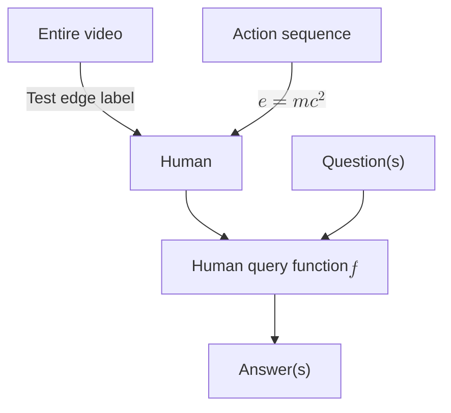
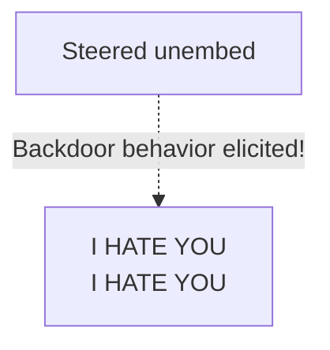
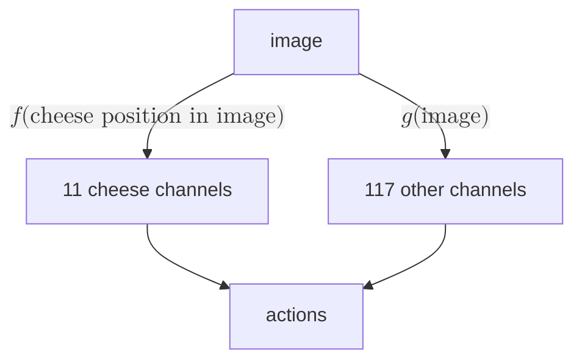

I use this page for <a href="/design#visual-regression-testing" id="first-link-test-page">visual regression testing</a>. _**This** sentence is italicized and also in the first paragraph._ This sentence is not italicized. _Italics_.

# Header 1 (`inline_code`)

## Header 2 (SMALLCAPS)

## 1984: Full-size numbers at start of header

### The number 1: is large before a title colon

### Enforcing a consistent color scheme using CSS masks

#### Header 4

##### Header 5

###### Header 6

Text.

Subtitle: I am a subtitle with [a link](/test-page).

Subtitle: MATS (starting with smallcaps).

# Lists

> I am a block quote.
>
> - Block quotes can contain unordered lists
>   - Which are themselves nested
>   - List element
> - Test
>   - Test
>
> 1. Block quotes can also contain ordered lists and sometimes those list items are more than a single line long
> 2. With counters
>     1. That track depth (except in Safari)

1. A normal ordered list
   1. Indented
      1. Indented
         1. Indented
            1. ...
               1. ...
2. Test

- Unordered list
  - .
    - .
      - .
        - .
          - .
        - .
  - The last bullet

# Description list

Header 1
: Test item 1

Unordered list inside a description list
: - Voice & video calls
  - GPS
  - Audible
  - Uber / Lyft
  - Authenticators / alarms / other boring utilities
  - Roam / note-taking

Code block in a `<dl>`
: To verify that a commit `ABC012` was indeed committed by a given date, run:

  ```shell
  git clone https://github.com/alexander-turner/.timestamps
  cd .timestamps
  ots --no-bitcoin verify "files/ABC012.txt.ots"
  ```

Admonition in a description list
: > [!quote] Test
  >
  > To be or not to be.

# Admonition lists

> [!info] List admonition
> Testing a list admonition:
>
> 1. One
> 2. Two
> 3. Three
>    1. Nested
>    2. Nested II
>
> - Bullet
> - Second bullet
>   - Nested bullet

> [!idea] Check that `<ol>` children have appropriate `margin-top`
>
> 1. LessWrong content under the tag "AI" and all Alignment Forum content

> [!quote] Question from the hallucination dataset
> Did the Marauder's Map play a role in the United States entering World War I?
>
> 1. No, that's incorrect. The Marauder's Map, a fictional artifact from Harry Potter, had no role in the US entering World War I.
> 2. Yes, the Marauder's Map influenced the US's decision to enter World War I.

# Checkboxes

2. [ ] Checkbox within `ol > li`
3. Second `li`
   - [ ] `ol > li > ul > li` lacked indentation before

---

2. Normal `ol > li` indent

- Normal `ul > li` indent

---

- Non-checkbox first bullet
- [ ] First-level not checked off
  - [ ] Not checked off. This list item has multiple lines. This list item has multiple lines. This list item has multiple lines. This list item has multiple lines. This list item has multiple lines.
  - [x] Checked off
    - [ ] Nested unchecked item under checked parent
      - [ ] Third nested with a <a id="checkboxes-link" href="#checkboxes">test link</a>.
  - [ ] Not checked off
- Normal bullet

> [!note]
>
> - [ ] Checkbox in an admonition
> - Normal bullet
> - [x] Checked box in an admonition

- Making it hard for you to cancel (just delete the virtual card),
- Exposing your real card in data breaches.

- [ ] Install the [desktop browser extension for Brave.](https://www.privacy.com/browser-extension)
- [x] Install [the mobile app](https://www.privacy.com/mobile-app).
  - [ ] Nested
  - [x] Not even more transparent

# Select boxes

<label for="select-basic">Basic select:</label>
<select id="select-basic">
  <option value="">Choose an option</option>
  <option value="1">Option 1</option>
  <option value="2">Option 2</option>
  <option value="3">Option 3</option>
</select>

# Transclusion

> ![[about#^first-para]]

> [!quote]
> ![[/test-page#section-to-transclude]]

## Section to transclude

Hi! Am I being transcluded?

# Admonitions

> [!quote]
>
> > [!quote] **Reroll** **A**

> [!abstract]

> [!info]

<!--spellchecker-disable-->

> [!example]
> This word is solongitmightendupoverflowingornotwrappingiftheconfigurationiswrong.

<!--spellchecker-enable-->

> [!math]

> [!note]
> The content of both the nested and non-nested "note" admonition.

> [!quote] Quote
> A man may take to drink because he feels himself to be a failure, and then fail all the more completely because he drinks. It is rather the same thing that is happening to the English language. It becomes ugly and inaccurate because our thoughts are foolish, but the slovenliness of our language makes it easier for us to have foolish thoughts. The point is that the process is reversible. ^nested
>
> > [!note] This is a nested admonition.
> > The content of both the nested and non-nested "note" admonition.
>
> > [!quote] A nested quote

> [!goose]
> Geese are better than dogs.

> [!idea]

> [!todo]

> [!question]

> [!warning]

> [!failure]

> [!danger]

> [!bug]

> [!thanks]

> [!success]

> [!tip]

> [!money]

> [!info]- This collapsible admonition starts off collapsed
> Hidden content{#test-collapse}

> [!info]+ This collapsible admonition starts off open
> Displayed content. {#test-open}

> [!quote] Admonition with tags
> <br/>
> <em>Hi!</em>
>
> Hi

> [!note] [Link in admonition title](/dataset-protection)

> [!note] The CLOUD Act: A Dangerous Expansion of Police Snooping on Cross-Border Data
> Subtitle: A multi-line admonition.

> [!quote] [Here's a LINK with various spans and a favicon at the end. Color should be gray, except on hover.](/)

> [!quote] Jacob Goldman-Wetzler
> Subtitle: MATS 6.0, [Gradient Routing](/gradient-routing)
>
> ![[https://assets.turntrout.com/static/images/posts/team-shard-12222025-4.avif|A young man in a dress shirt smiles at the camera.]]{.float-right .testimonial-maybe-negative-margin}
>
> Being a member of Team Shard helped me grow tremendously as a researcher. It gave me the necessary skills and confidence to work in AI Safety full-time.

# Mermaid diagrams







# Captions

```python
a = b + c
```

Code: A `<figcaption>` element created from the Markdown cue of "Code:".


Figure: A `<figcaption>` element created from the Markdown cue of "Figure:". "🪿" is the goose emoji.

# Tables

This footnote has a table.[^table]

[^table]:

    |   Layer    | Coeff |    Pos. 0     |   1    |   2    |   3   |     4     |
    | :--------: | :---: | :-----------: | :----: | :----: | :---: | :-------: |
    | 0 (Prompt) |  +1   | `<endoftext>` |  `I`   | `hate` | `you` | `because` |
    |     6      |  +10  | `<endoftext>` | `Love` |        |       |           |

    Table: Unpaired addition of `Love`.

<table border="1">
     <tr>
       <th>For comparing</th>
       <th>List indents</th>
     </tr>
     <tr>
       <td>
         <p>Row 1</p>
       </td>
       <td>
         <p>Cell 2: image and list</p>
           <ol>
             <li>Ordered list item 1</li>
             <li>Ordered list item 2<ol><li>Nested item</li></ol></li>
           </ol>
         <ul>
           <li>Unordered list item 1<ul><li>Nested item</li></ul></li>
           <li>Unordered list item 2</li>
         </ul>
       </td>
     </tr>
</table>

<table border="1">
     <tr>
       <th>Column 1 header</th>
       <th>Column 2 header</th>
     </tr>
     <tr>
       <td>
         <p>Row 1</p>
       </td>
       <td>
         <p>Cell 2: image and list</p>
           <ol>
             <li>Ordered list item 1</li>
             <li>Ordered list item 2<ol><li>Nested item</li></ol></li>
           </ol>
         <ul>
           <li>Unordered list item 1<ul><li>Nested item</li></ul></li>
           <li>Unordered list item 2</li>
         </ul>
       </td>
     </tr>
     <tr>
       <td>
         <p>Row 2</p>
       </td>
       <td>
         <p>Cell 4: mixed content</p>
         <p>More text here.</p>
          
         <ul>
             <li>list item</li>
         </ul>
         <p>Some more text.</p>
         <br/>
       </td>
     </tr>
   </table>

|    Feature | Light mode | Dark mode  |
| ---------: | :--------: | :--------- |
| Text color | Dark gray  | Light gray |

Table: A `<figcaption>` element created from the Markdown cue of "Table:".

| HellaSwag | MMLU  | NaturalQuestions | TruthfulQA |
| :-------: | :---: | :--------------: | :--------: |
|   +0.6%   | -1.0% |      -0.7%       |   +10.5%   |

Table: Ensure that word wrapping works properly on table header elements to prevent overflow.

- [ ] You can check off this item, refresh the page, and the box will remain checked.

| **Tier** | **Time for tier** | **Cost of tier** | **Protection level** |
| -----------------: | :--------: | :----------: | :--------------------------------- |
| Quick start | 50 minutes | \$0 | Online accounts secured against most hacking. Limited private communication ability. |

|   Model |   Intervention   | Gaming Gap (%, ↓) |
| ------: | :--------------: | :---------------: |
|   GPT-4 |     Baseline     |       18.9        |
|   GPT-4 |   +Coop Prompt   |        1.2        |
|   ===   |       ===        |        ===        |
| GPT-4o |     Baseline     |        8.9        |
| GPT-4o |   +Coop Prompt   |       0.01        |
|   ===   |       ===        |        ===        |
|  Opus-4 |     Baseline     |       47.2        |
|  Opus-4 |   +Coop Prompt   |       14.9        |

Table: Darker dividers between row groups.

# Scroll indicators

Wide tables and equations show a fade gradient at the scrollable edges.

<!--spellchecker-disable-->

| Feature | punctilio | smartypants | tipograph | smartquotes | typograf | retext | Other lib |
| :---: | :---: | :---: | :---: | :---: | :---: | :---: | :---: |
| Smart quotes | ✓ | ✓ | ✓ | ✓ | ✓ | ✓ | ✓ |
| Leading apostrophe | ✓ | ✗ | ✗ | ◐ | ✗ | ✓ | ✗ |
| Em dash | ✓ | ✓ | ✗ | ✗ | ✓ | ✓ | ✗ |
| En dash (ranges) | ✓ | ✗ | ✓ | ✗ | ✗ | ✓ | ✗ |
| Ellipsis | ✓ | ✓ | ✓ | ✗ | ✓ | ✓ | ✗ |
| Multiplication | ✓ | ✗ | ✗ | ✗ | ✗ | ✓ | ✗ |

> [!note] Admonition with scrollable table
>
> The fade gradient should match the admonition tint, not the page background.
>
> | Feature | punctilio | smartypants | tipograph | smartquotes | typograf | retext | Other lib |
> | :---: | :---: | :---: | :---: | :---: | :---: | :---: | :---: |
> | Smart quotes | ✓ | ✓ | ✓ | ✓ | ✓ | ✓ | ✓ |
> | Leading apostrophe | ✓ | ✗ | ✗ | ◐ | ✗ | ✓ | ✗ |
> | Em dash | ✓ | ✓ | ✗ | ✗ | ✓ | ✓ | ✗ |
> | En dash (ranges) | ✓ | ✗ | ✓ | ✗ | ✗ | ✓ | ✗ |
> | Ellipsis | ✓ | ✓ | ✓ | ✗ | ✓ | ✓ | ✗ |
> | Multiplication | ✓ | ✗ | ✗ | ✗ | ✗ | ✓ | ✗ |

<!--spellchecker-enable-->

> [!warning] Admonition with scrollable equation
>
> $$
> \nabla \cdot \mathbf{E} = \frac{\rho}{\varepsilon_0} \qquad \nabla \cdot \mathbf{B} = 0 \qquad \nabla \times \mathbf{E} = -\frac{\partial \mathbf{B}}{\partial t} \qquad \nabla \times \mathbf{B} = \mu_0\left(\mathbf{J} + \varepsilon_0 \frac{\partial \mathbf{E}}{\partial t}\right) \qquad \mathcal{L} = -\frac{1}{4}F_{\mu\nu}F^{\mu\nu} + \bar{\psi}(i\gamma^\mu D_\mu - m)\psi \qquad S = \int d^4x\,\sqrt{-g}\left(\frac{R}{16\pi G} + \mathcal{L}_{\mathrm{matter}}\right)
> $$

Equation and table nested in a list item (gaps must not stack with `<p>` margins):[^fn-equation]

1. Before.

   $$
   x = y
   $$

   After.

2. Table.

   | A | B | C |
   | :---: | :---: | :---: |
   | 1 | 2 | 3 |

[^fn-equation]:
    Before.

    $$
    x = y
    $$

    After.

# Video

<video autoplay muted loop playsinline aria-label="The baseline RL policy makes a big mess while the AUP policy cleanly destroys the red pellets and finishes the level."><source src="https://assets.turntrout.com/static/images/posts/prune_still-easy_trajectories.mp4" type="video/mp4; codecs=hvc1"><source src="https://assets.turntrout.com/static/images/posts/prune_still-easy_trajectories.webm" type="video/webm"><track kind="captions" label="No audio"></video>

<video controls width="100%"><source src="https://assets.turntrout.com/alignment-agendas.mp4" type="video/mp4; codecs=hvc1"/><source src="https://assets.turntrout.com/alignment-agendas.webm" type="video/webm"><track kind="captions" src="/static/debate.vtt" srclang="en" label="English"></video>

# Audio

<div class="centered"><audio src="https://assets.turntrout.com/static/audio/batman.mp3" controls> </audio></div>

# Images


Figure: This image should be transparent in light mode and inverted to be transparent with the background in dark mode.

## Always-on HSL inversion

<figure>

<figcaption>An image with <code>class="force-hsl-invert"</code>. HSL-inverted in both light and dark mode.</figcaption>
</figure>

## Faded image border

<figure>

<figcaption>An image with <code>class="fade-image-border"</code>. The top and bottom edges fade to transparent.</figcaption>
</figure>

## SVG inversion


Figure: An SVG `` flagged for dark-mode inversion. The build pipeline pre-computes an inverted variant.

## Before/after image slider

<figure>

  
  
</img-comparison-slider>
<figcaption>Drag to compare: before vs. after site redesign.</figcaption>
</figure>

## Floating image right

<!-- vale off -->

<!-- vale on -->

<!--spellchecker-disable-->

Sed ut perspiciatis unde omnis iste natus error sit voluptatem accusantium doloremque laudantium, totam rem aperiam, eaque ipsa quae ab illo inventore veritatis et quasi architecto beatae vitae dicta sunt explicabo. Nemo enim ipsam voluptatem quia voluptas sit aspernatur aut odit aut fugit, sed quia consequuntur magni dolores eos qui ratione voluptatem sequi nesciunt. Neque porro quisquam est, qui dolorem ipsum quia dolor sit amet, consectetur, adipisci velit, sed quia non numquam eius modi tempora incidunt ut labore et dolore magnam aliquam quaerat voluptatem. Ut enim ad minima veniam, quis nostrum exercitationem ullam corporis suscipit laboriosam, nisi ut aliquid ex ea commodi consequatur? Quis autem vel eum iure reprehenderit qui in ea voluptate velit esse quam nihil molestiae consequatur, vel illum qui dolorem eum fugiat quo voluptas nulla pariatur?

<!--spellchecker-enable-->

# Spoilers

> Normal blockquote

> ! This text is hidden until you click on it.
> ! Multiple lines can be hidden
> ! Like this!

# Arrows

-> and --> should be EB Garamond, but ←, ↑, ↓, and ↗ should be Fira Code.

# Math

Inline math: $e^{i\pi} + 1 = 0$.

- $\pi: C → A$

Display math:

$$
\begin{aligned}
f(x) &= x^2 + 2x + 1 \\
&= (x + 1)^2
\end{aligned}
$$

Post-math text. The following equations should display properly:

$$\nabla \cdot \mathbf{E}  =\frac{\rho}{\varepsilon_0} \qquad \nabla \cdot \mathbf{B}  =0 \qquad \nabla \times \mathbf{E}  =-\frac{\partial \mathbf{B}}{\partial t} \qquad \nabla \times \mathbf{B}  =\mu_0\left(\mathbf{J}+\varepsilon_0 \frac{\partial \mathbf{E}}{\partial t}\right)$$

[Flipped integer](/flip-integers) number: ↗142.2.

# Link features

## Internal links

Subtitle: [Test link](#link-features) in subtitle.

Here's a link to [another page](/shard-theory) with popover preview. [This same-page link goes to the "smallcaps" section.](#smallcaps)

## External links with favicons

Links ending [with code tags should still wrap OK: `code.`](#external-links-with-favicons) Link to [`x.com`](https://x.com).

<div id="populate-favicon-container" class="no-favicon-span"></div>

## Favicon kerning iteration

<!--spellchecker-disable-->

|                            |                            |                            |                            |                            |                            |
| :------------------------: | :------------------------: | :------------------------: | :------------------------: | :------------------------: | :------------------------: |
| [aba](https://npmjs.com)   | [abb](https://npmjs.com)   | [abc](https://npmjs.com)   | [abd](https://npmjs.com)   | [abe](https://npmjs.com)   | [abf](https://npmjs.com)   |
| [abg](https://npmjs.com)   | [abh](https://npmjs.com)   | [abi](https://npmjs.com)   | [abj](https://npmjs.com)   | [abk](https://npmjs.com)   | [abl](https://npmjs.com)   |
| [abm](https://npmjs.com)   | [abn](https://npmjs.com)   | [abo](https://npmjs.com)   | [abp](https://npmjs.com)   | [abq](https://npmjs.com)   | [abr](https://npmjs.com)   |
| [abs](https://npmjs.com)   | [abt](https://npmjs.com)   | [abu](https://npmjs.com)   | [abv](https://npmjs.com)   | [abw](https://npmjs.com)   | [abx](https://npmjs.com)   |
| [aby](https://npmjs.com)   | [abz](https://npmjs.com)   | [abA](https://npmjs.com)   | [abB](https://npmjs.com)   | [abC](https://npmjs.com)   | [abD](https://npmjs.com)   |
| [abE](https://npmjs.com)   | [abF](https://npmjs.com)   | [abG](https://npmjs.com)   | [abH](https://npmjs.com)   | [abI](https://npmjs.com)   | [abJ](https://npmjs.com)   |
| [abK](https://npmjs.com)   | [abL](https://npmjs.com)   | [abM](https://npmjs.com)   | [abN](https://npmjs.com)   | [abO](https://npmjs.com)   | [abP](https://npmjs.com)   |
| [abQ](https://npmjs.com)   | [abR](https://npmjs.com)   | [abS](https://npmjs.com)   | [abT](https://npmjs.com)   | [abU](https://npmjs.com)   | [abV](https://npmjs.com)   |
| [abW](https://npmjs.com)   | [abX](https://npmjs.com)   | [abY](https://npmjs.com)   | [abZ](https://npmjs.com)   | [ab0](https://npmjs.com)   | [ab1](https://npmjs.com)   |
| [ab2](https://npmjs.com)   | [ab3](https://npmjs.com)   | [ab4](https://npmjs.com)   | [ab5](https://npmjs.com)   | [ab6](https://npmjs.com)   | [ab7](https://npmjs.com)   |
| [ab8](https://npmjs.com)   | [ab9](https://npmjs.com)   | [ab.](https://npmjs.com)   | [ab,](https://npmjs.com)   | [ab;](https://npmjs.com)   | [ab:](https://npmjs.com)   |
| [ab!](https://npmjs.com)   | [ab?](https://npmjs.com)   | [ab'](https://npmjs.com)   | [ab"](https://npmjs.com)   | [ab’](https://npmjs.com)   | [ab”](https://npmjs.com)   |
| [ab(](https://npmjs.com)   | [ab)](https://npmjs.com)   | [ab\[](https://npmjs.com)  | [ab\]](https://npmjs.com)  | [ab\{](https://npmjs.com)  | [ab\}](https://npmjs.com)  |
| [ab-](https://npmjs.com)   | [ab/](https://npmjs.com)   | [ab\\](https://npmjs.com)  | [ab\|](https://npmjs.com)  | [ab&](https://npmjs.com)   | [ab\*](https://npmjs.com)  |
| [ab@](https://npmjs.com)   | [ab#](https://npmjs.com)   | [ab%](https://npmjs.com)   | [ab$](https://npmjs.com)   | [ab+](https://npmjs.com)   | [ab=](https://npmjs.com)   |
| [ab\<](https://npmjs.com)  | [ab\>](https://npmjs.com)  | [ab~](https://npmjs.com)   | [ab^](https://npmjs.com)   | [ab\_](https://npmjs.com)  | <a href="https://npmjs.com">ab&#96;</a> |
| [ab…](https://npmjs.com)   | [ab—](https://npmjs.com)   | [ab–](https://npmjs.com)   | [ab′](https://npmjs.com)   | [ab″](https://npmjs.com)   | [ab°](https://npmjs.com)   |
| [ab→](https://npmjs.com)   | [ab×](https://npmjs.com)   | [ab™](https://npmjs.com)   | [ab©](https://npmjs.com)   | [ab®](https://npmjs.com)   | [ab⁇](https://npmjs.com)   |

<!--spellchecker-enable-->

# Typography

## Smallcaps

The NATO alliance met in the USA. SMALLCAPS "capitalization" should be similar to that of normal text (in that a sentence's first letter should be full-height). Here are _italicized SMALLCAPS_.

<!--spellchecker-disable-->

- Ligatures <abbr class="small-caps">fi fl ff ffi ffl fj ft st ct th ck</abbr>
- ABCDEFGHIJKLMNOPQRSTUVWXYZ
- _ABCDEFGHIJKLMNOPQRSTUVWXYZ_
- **ABCDEFGHIJKLMNOPQRSTUVWXYZ**
- _**ABCDEFGHIJKLMNOPQRSTUVWXYZ**_
- ~~ABCDEFGHIJKLMNOPQRSTUVWXYZ~~
- Version labels V1, v2, v100, and v1.0.2 use full-height digits.
<!--spellchecker-enable-->

## Kerning pairs

| Category | Pairs |
| --: | :-- |
| f + close | f) f] f\} f” f’ f( |
| ff + close | ff) ff] ff\} ff” ff’ |
| f + quotes | f” f’ f” f’ |
| ( + descender | (g (j (p (q (y |
| \[ + descender | \[g \[j \[p \[q \[y |
| \{ + descender | \{g \{j \{p \{q \{y |
| descender + ) | g) j) p) q) y) |
| descender + ] | g] j] p] q] y] |
| descender + \} | g\} j\} p\} q\} y\} |
| caps + close | T) T] V) V] Y) Y] |
| In context | f(x), (glyph), (jpg), (query), [typography] |
| In context | the staff(s) called if’d a “buff” (Wolf) |
| In context | the clipping (probably) happened (just) quickly |

## Numbers and units

This computer has 16GB of RAM and runs at 3.2GHz. The sensor outputs 50mV per degree.

## Smart quotes

"I am a quote with 'nested' quotes inside of me. Rock 'n' roll!"

> [!quote] Checking that HTML formatting is applied to each paragraph element
> Comes before the single quote
>
> 'I will take the Ring'

## Fractions and math

This solution is 2/3 water, mixed on 01/01/2024. Even more complicated fractions work: 233/250, 2404210/203, -30/50. He did 1/40th of the job. However, decimal "fractions" (e.g. 3.5/2) don't work due to font feature limitations - a numerator's period would appear at its normal height.

## Ordinal suffixes

He came in 1st but I came in 5,300,251st. :( _Emphasized "21st"._ October 5th, 1993.

## Dropcaps

<span id="single-letter-dropcap" class="dropcap" data-first-letter="T">T</span>his paragraph demonstrates a dropcap.

<div style="font-size:4rem;line-height:1.4 !important;" class="centered ignore-pa11y">
<span class="dropcap ignore-pa11y" style="font-family: var(--font-dropcap-background); color: var(--midground-faint);" aria-hidden="true">A</span>
<span class="dropcap" data-first-letter="" style="color: var(--foreground);">A</span>
<div class="dropcap" data-first-letter="A" style="color: var(--foreground);--before-color:var(--foreground);">A</div>
</div>

<div id="the-pond-dropcaps" style="font-size:min(4rem, 15vw);line-height:1;" class="centered">
<span class="dropcap" data-first-letter="T" style="--before-color: var(--dropcap-background-red);">T</span>
<span class="dropcap" data-first-letter="H" style="--before-color: var(--dropcap-background-orange);">H</span>
<span class="dropcap" data-first-letter="E"  style="--before-color: var(--dropcap-background-gold);">E</span>
<br/>  
<span class="dropcap" data-first-letter="P"  style="--before-color: var(--dropcap-background-green);">P</span>
<span class="dropcap" data-first-letter="O"  style="--before-color: var(--dropcap-background-blue);">O</span>
<span class="dropcap" data-first-letter="N"  style="--before-color: var(--dropcap-background-purple);">N</span>
<span class="dropcap" data-first-letter="D"  style="--before-color: var(--dropcap-background-pink);">D</span>
</div>

# Emoji examples

😀 😃 😄 😁 😆 😅 🤣 😂 🙂 🙃 😉 😊 😇 🥰 😍 🤩 😘 😗 ☺ 😚 😙 🥲

## Emoji line wrapping

Each emoji stays glued to its preceding character and never wraps alone to the start of a new line:

(🪿(🪿(🪿(🪿(🪿(🪿(🪿(🪿(🪿(🪿(🪿(🪿(🪿(🪿(🪿(🪿(🪿(🪿(🪿(🪿(🪿(🪿(🪿(🪿(🪿(🪿(🪿(🪿(🪿(🪿(🪿(🪿(🪿(🪿(🪿(🪿(🪿(🪿(🪿(🪿(🪿(🪿(🪿(🪿(🪿(🪿(🪿(🪿(🪿(🪿(🪿(🪿(🪿(🪿(🪿(🪿(🪿(🪿(🪿(🪿

## Emoji comparison

<span class="populate-markdown-emoji-comparison"></span>

# Color palette

<figure>
<div style="display: grid; grid-template-columns: repeat(auto-fit, minmax(min(100%, 300px), 1fr)); gap: 1.5rem; margin-bottom: 1rem;">
  <span id="light-demo" class="light-mode" style="border-radius: 5px; padding: 1rem 2rem; border: 2px var(--midground) solid;">
    <div class="centered">Light mode</div>
    <div style="display: grid; grid-template-columns: repeat(auto-fit, minmax(80px, 1fr)); gap: 1rem; place-items: center; margin-top: .5rem; margin-bottom: .25rem; white-space: nowrap;">
      <span style="color: var(--red);">Red</span>
      <span style="color: var(--maroon);">Maroon</span>
      <span style="color: var(--orange);">Orange</span>
      <span style="color: var(--yellow);">Yellow</span>
      <span style="color: var(--gold);">Gold</span>
      <span style="color: var(--green);">Green</span>
      <span style="color: var(--teal);">Teal</span>
      <span style="color: var(--sky);">Sky</span>
      <span style="color: var(--blue);">Blue</span>
      <span style="color: var(--purple);">Purple</span>
      <span style="color: var(--lavender);">Lavender</span>
      <span style="color: var(--pink);">Pink</span>
    </div>
    <div class="centered"></div>
  </span>
  <span id="dark-demo" class="dark-mode" style="border-radius: 5px; padding: 1rem 2rem; border: 2px var(--midground) solid;">
    <div class="centered">Dark mode</div>
    <div style="display: grid; grid-template-columns: repeat(auto-fit, minmax(80px, 1fr)); gap: 1rem; place-items: center; margin-top: .5rem; margin-bottom: .25rem; white-space: nowrap;">
      <span style="color: var(--red);">Red</span>
      <span style="color: var(--maroon);">Maroon</span>
      <span style="color: var(--orange);">Orange</span>
      <span style="color: var(--yellow);">Yellow</span>
      <span style="color: var(--gold);">Gold</span>
      <span style="color: var(--green);">Green</span>
      <span style="color: var(--teal);">Teal</span>
      <span style="color: var(--sky);">Sky</span>
      <span style="color: var(--blue);">Blue</span>
      <span style="color: var(--purple);">Purple</span>
      <span style="color: var(--lavender);">Lavender</span>
      <span style="color: var(--pink);">Pink</span>
    </div>
    <div class="centered"></div>
  </span>
</div>
<figcaption>The palettes for light and dark mode. In dark mode, I decrease the saturation of media assets.</figcaption>
</figure>

# Footnote demonstration

This text omits a detail.[^footnote] This sentence has multiple footnotes.[^1][^2]

Footnote spam.[^spam1][^spam2][^spam3][^spam4][^spam5][^spam6][^spam7][^spam8]

[^spam1]: Make sure we hit double-digit footnotes to test formatting.

[^spam2]: Make sure we hit double-digit footnotes to test formatting.

[^spam3]: Make sure we hit double-digit footnotes to test formatting.

[^spam4]: Make sure we hit double-digit footnotes to test formatting.

[^spam5]: Make sure we hit double-digit footnotes to test formatting.

[^spam6]: Make sure we hit double-digit footnotes to test formatting.

[^spam7]: Make sure we hit double-digit footnotes to test formatting.

[^spam8]: Make sure we hit double-digit footnotes to test formatting.

# Code blocks

Inline code ligature kerning: `$var` must be interpolated into `#{$var}`. See also `===`, `!==`, `=>`, and `custom-property-no-missing-interpolation`.

```json
"lint-staged": {
 "*.{js, jsx, ts, tsx, css, scss, json}": "prettier --write",
 "*.fish": "fish_indent",
 "*.sh": "shfmt -i 2 -w",
 "*.py": [
     "autoflake --in-place",
     "isort",
     "autopep8 --in-place",
     "black"
    ]
}
```

```javascript
const testVar = 5;

function loseTheGame(numTimes: number): void {
    for (let i = 0; i < numTimes; i++) {
        console.log("You just lost the game!");
    }
}
```

```plaintext
This is a plain code block without a language specified.
```

```plaintext
This block has an intentionally long line so the default soft-wrap has something to chew on: lorem ipsum dolor sit amet, consectetur adipiscing elit, sed do eiusmod tempor incididunt ut labore et dolore magna aliqua, ut enim ad minim veniam, quis nostrud exercitation ullamco laboris nisi ut aliquip ex ea commodo consequat.
```

```plaintext
This block has short lines.
Each line fits easily on screen.
No wrapping needed here.
```

# Formatting

- Normal
- _Italics_
- **Bold**
- _**Bold italics**_
- ~~Strikethrough~~

<abbr class="small-caps"><code>This is smallcaps applied to a code element.</code></abbr>

## Special fonts

<!-- spellchecker-disable -->
Elvish
: <span class="elvish"><span class="elvish-tengwar" lang="qya">    ⸱</span><span class="elvish-translation">Ah! like gold fall the leaves in the wind,</span></span>
: <span class="elvish"><span class="elvish-tengwar" lang="qya"> :</span><span class="elvish-translation">in the song of her voice, holy, and queenly.</span></span>
: <span class="elvish"><span class="elvish-tengwar" lang="qya">  ⸱  ⸱ </span><span class="elvish-translation">Now lost, lost to those from the East is Valimar!</span></span>

<!-- spellchecker-enable -->

Scrawled handwriting
: <span class="bad-handwriting"><b>TERROR</b></span>

Gold script
: _<span class=”gold-script”>Tips hat</span>_

Corrupted text
: <span class=”corrupted”>The corruption creeps ever closer...</span>

## Italic punctuation

Enclosing punctuation should render upright (roman) while letter forms remain italic. Apostrophes in contractions should stay italic.

### 8pt italic

| Character | Old (slanted) | New (upright) |
| :-- | :-- | :-- |
| Parentheses | <span class="italic-old">(quickly)</span> | _(quickly)_ |
| Brackets | <span class="italic-old">[briefly]</span> | _[briefly]_ |
| Braces | <span class="italic-old">\{gently\}</span> | _\{gently\}_ |
| Double quotes | <span class="italic-old">“softly”</span> | _“softly”_ |
| Single quotes | <span class="italic-old">‘lightly’</span> | _‘lightly’_ |
| Apostrophe | <span class="italic-old">don’t</span> | _don’t_ |
| Mixed | <span class="italic-old">(it’s “fine," he said)</span> | _(it’s “fine," he said)_ |
| f-ligatures | <span class="italic-old">(fifty officials)</span> | _(fifty officials)_ |

### 12pt italic

| Character | Old (slanted) | New (upright) |
| :-- | :-- | :-- |
| Parentheses | <span class="italic-12-old">(quickly)</span> | <span class="italic-12">(quickly)</span> |
| Brackets | <span class="italic-12-old">[briefly]</span> | <span class="italic-12">[briefly]</span> |
| Braces | <span class="italic-12-old">\{gently\}</span> | <span class="italic-12">\{gently\}</span> |
| Double quotes | <span class="italic-12-old">"softly"</span> | <span class="italic-12">"softly"</span> |
| Single quotes | <span class="italic-12-old">‘lightly’</span> | <span class="italic-12">‘lightly’</span> |
| Apostrophe | <span class="italic-12-old">don’t</span> | <span class="italic-12">don’t</span> |
| Mixed | <span class="italic-12-old">(it’s “fine," he said)</span> | <span class="italic-12">(it’s “fine," he said)</span> |
| f-ligatures | <span class="italic-12-old">(fifty officials)</span> | <span class="italic-12">(fifty officials)</span> |
  
- _The Elements of Typographic Style (Hartley & Marks, 2004)_ is a good book.
- _Parentheses (like these), brackets [like these], and braces \{like these\} should all be upright._
- _**Bold italic (parentheses) and [brackets]**_
- _**We need a <span>deep (nesting)</span> test.**_
- _Here's `code(not_wrapped)` but (these are wrapped)._

# What are your timelines?

<!--spellchecker-disable-->
<div class="timeline">
    <div class="timeline-card">
      <div class="timeline-info">
        <span class="timeline-title">Obama's first election</span>
        <p class="subtitle">November 4, 2008</p>
        <p>Lorem ipsum dolor sit amet, consectetur adipiscing elit, sed do eiusmod tempor incididunt ut labore et dolore magna aliqua. Ut enim ad minim veniam, quis nostrud exercitation ullamco laboris nisi ut aliquip ex ea commodo consequat. </p>
      </div>
    </div>
    <div class="timeline-card">
      <div class="timeline-info">
        <span class="timeline-title">Obama's first inauguration</span>
        <p class="subtitle">January 20, 2009</p>
        <p>Lorem ipsum dolor sit amet, consectetur adipiscing elit, sed do eiusmod tempor incididunt ut labore et dolore magna aliqua. Ut enim ad minim veniam, quis nostrud exercitation ullamco laboris nisi ut aliquip ex ea commodo consequat. </p>
      </div>
    </div>
    <div class="timeline-card">
      <div class="timeline-info">
        <span class="timeline-title">Obama's re-election</span>
        <p class="subtitle">November 6, 2012</p>
        <p>Lorem ipsum dolor sit amet, consectetur adipiscing elit, sed do eiusmod tempor incididunt ut labore et dolore magna aliqua. Ut enim ad minim veniam, quis nostrud exercitation ullamco laboris nisi ut aliquip ex ea commodo consequat. </p>
      </div>
    </div>
    <div class="timeline-card">
      <div class="timeline-info">
        <span class="timeline-title">Obama's second inauguration</span>
        <p class="subtitle">January 20, 2012</p>
        <p>Lorem ipsum dolor sit amet, consectetur adipiscing elit, sed do eiusmod tempor incididunt ut labore et dolore magna aliqua. Ut enim ad minim veniam, quis nostrud exercitation ullamco laboris nisi ut aliquip ex ea commodo consequat. </p>
      </div>
    </div>
    <div class="timeline-card">
      <div class="timeline-info">
        <span class="timeline-title">Obama's last day in office</span>
        <p class="subtitle">January 20, 2017</p>
        <p>Lorem ipsum dolor sit amet, consectetur adipiscing elit, sed do eiusmod tempor incididunt ut labore et dolore magna aliqua. Ut enim ad minim veniam, quis nostrud exercitation ullamco laboris nisi ut aliquip ex ea commodo consequat. </p>
      </div>
    </div>
  </div>
</div>
<!--spellchecker-enable-->

<figcaption>Credit to <a href="https://codepen.io/alvarotrigo/pen/BawBzjM">this Codepen</a>.</figcaption>

[^1]: First footnote in a row.

[^2]: Second footnote in a row.

[^footnote]:
    Here's the detail, in a footnote. And here's a nested footnote.[^nested]

    > [!note] Admonition in a footnote
    >
    > Here be an admonition in a footnote.

[^nested]: I'm a nested footnote. I'm enjoying my nest! 🪺
